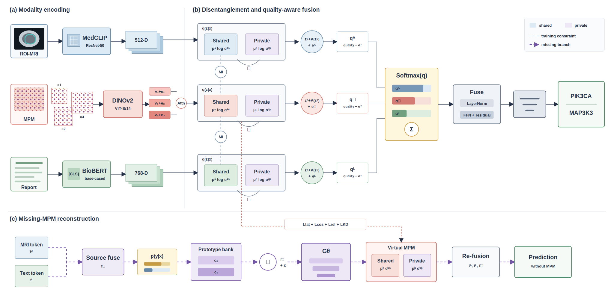

# MQP

MQP is a missing-modality multimodal classifier for PIK3CA/MAP3K3 prediction.
It combines ROI-MRI, multiscale MPM pathology, and English clinical-report
representations, while learning an MRI-to-MPM latent reconstructor for inference
when pathology is unavailable.



## Repository contents

- `scripts/train_mqp_cv.py`: complete grouped five-fold training and evaluation.
- `scripts/build_english_text_features.py`: BioBERT text feature extraction.
- `checkpoints/`: five de-identified fold checkpoints.
- `results/`: aggregate metrics only; no per-patient predictions.
- `MODEL_CARD.md`: intended use, architecture, and limitations.

## Environment

The original run used Python 3.9, PyTorch 2.8.0+cu128, Transformers 4.57.6,
and h5py 3.14.0. A fresh environment can be created with:

```bash
conda create -n mqp python=3.9 -y
conda activate mqp
pip install -r requirements.txt
```

## Data preparation

Raw clinical data are not distributed. Prepare the feature layout described in
`data/README.md`. To encode English reports with BioBERT:

```bash
python scripts/build_english_text_features.py --workbook data/reports.xlsx
```

## Training

Run the formal grouped five-fold experiment:

```bash
python scripts/train_mqp_cv.py
```

Use `--quick` for a short pipeline check and `--cpu` to disable CUDA. Every fold
fits preprocessing, the multimodal teacher, and the missing-MPM student using
training-fold data only.

## Reported results

Five-fold mean metrics on the 41-case development cohort:

| Input | Accuracy | Balanced accuracy | Macro-F1 | AUC |
|---|---:|---:|---:|---:|
| MRI | 0.5889 | 0.5700 | 0.5489 | 0.6297 |
| MPM | 0.6806 | 0.7383 | 0.6688 | **0.8497** |
| Text | 0.5611 | 0.5717 | 0.5324 | 0.5781 |
| MRI + MPM | 0.6361 | 0.6617 | 0.6211 | 0.8194 |
| MRI + Text | 0.6611 | 0.6583 | 0.6376 | 0.6417 |
| MPM + Text | 0.6111 | 0.6250 | 0.5943 | 0.7731 |
| MRI + MPM + Text | **0.7056** | **0.7500** | **0.7017** | 0.7814 |
| MRI + reconstructed MPM | 0.5861 | 0.5667 | 0.5269 | 0.6311 |
| MRI + Text + reconstructed MPM | 0.6583 | 0.6717 | 0.6381 | 0.6425 |

These are exploratory internal-validation results, not independent-test results.

## Reference

Conceptual inspiration: *MIDAS: Mutual Information Disentanglement with
Uncertainty-Aware Fusion for Incomplete Multimodal Sentiment Analysis*, IEEE
Transactions on Pattern Analysis and Machine Intelligence, 2026,
doi: `10.1109/TPAMI.2026.3713694`.
